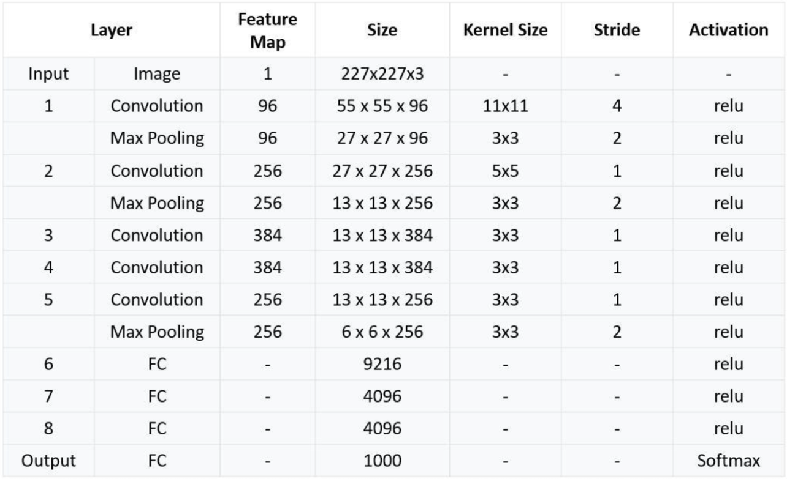

# AlexNet
<div style="text-align: center;">
    
</div>

## Implementation
The picture shows that the architecture has 8 layers, the first 5 layers are `convolutional` layers and the last 3 are `fully-connected` layers. The `conv` layers have this structure, where the input and output features are described in the picture, as well as kernel size, stride and padding values.
```python
self.conv = nn.Sequential(
    nn.Conv2d(),
    nn.ReLU(),
    nn.MaxPool2d()
)
```
For the `fully-connected` layers the structure, most of the time is similar to this:
```python
self.fc = nn.Sequential(
    nn.Linear(),
    nn.ReLU()
)
```
In the `forward` function is defined how the input should be elaborated when passing trough the network. It should be noted that the output of the latest convolutional layer is being flattened because it needs to be used as input for an MLP layer. Another thing to consider is that the picture shows that the output should return a vector of 1000 elements, but in the implementation this value is parameterized using `num_classes`.
