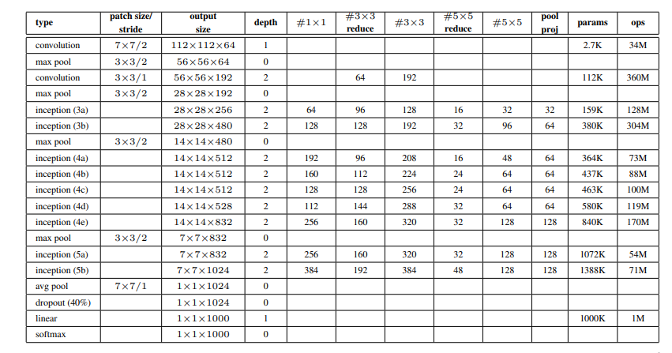
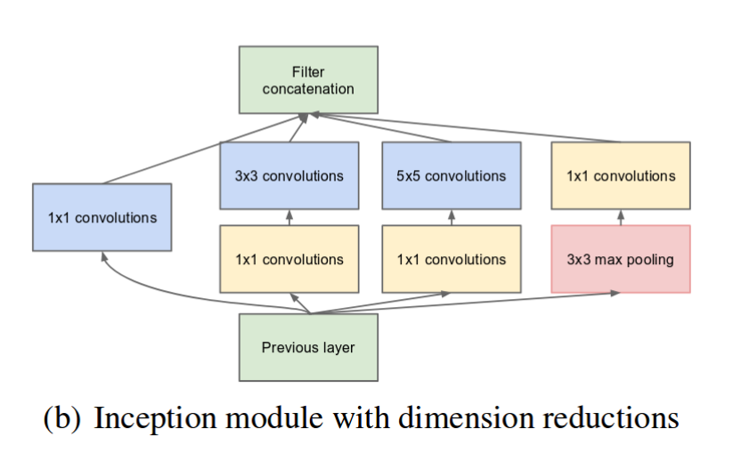

# GoogLeNet v1
<div style="text-align: center;">
    
</div>

The `GoogLeNet` architecture is very long to implement, is it recommended to implement the inception block and auxiliary classifier first to shorten the implementation of the `GoogLeNet` class. The image below shows an overview of the network, with kernel size, stride and more information. There are 4 version of inception block at the moment only the `v1` is implemented. Inside the `InceptionModule` folder there are the implementation of the 4 version of the inception block.
<div style="text-align: center;">
    
</div>

## Inception block (v1)
<div style="text-align: center;">
    
</div>

In this image is represented the first version of the inception module, to implement it the `InceptionModulev1` class has this structure:
```py
from torch import nn
import torch

class InceptionModulev1(nn.Module):
    def __init__(self) -> None:
        self.branch1  # 1x1 conv
        self.branch2  # 1x1 conv -> 3x3 conv
        self.branch3  # 1x1 conv -> 5x5 conv 
        self.branch4  # max pool -> 1x1 conv

        self.aux_classifier  # to specify auxiliary classification if needed
        self.aux_value  # output of the self.aux_classifier

    def forward(self, x:torch.Tensor, mode:bool = False):
        b1_out = self.branch1(x)
        b2_out = self.branch2(x)
        b3_out = self.branch3(x)
        b4_out = self.branch4(x)
        
        if self.aux_classifier != None and mode:
            self.aux_value = self.aux_classifier(x)

        return torch.cat([b1_out, b2_out, b3_out, b4_out], dim=1)
```
- as shown in the image 4 branches are defined inside the constructor
- if needed the `self.aux_classifier` stores the auxiliary classification network, and the `self.aux_value` stores the output of the auxiliary classifier
- the `forward()` recieves as parameters the tensor of the previous layer and a `mode` that tells if the `GoogLeNet` is in training mode or evaluation mode. This is convenient because the output is only needed when the `GoogLeNet` is in training mode.
## Auxiliary classifier
The structure of the auxiliary classifier is already shown in the first picture, and it's all shown inside `aux_classifier.py`

## Implementation
After implementing the `InceptionModulev1` and the `AuxClassifier`, it's possible now to implement the full network following the iperparameters shown in the second image. Inside the `GoogLeNet` class the inception module is returned with the  `inception_module()` based on the `self.inception_block_version` that is being passed.