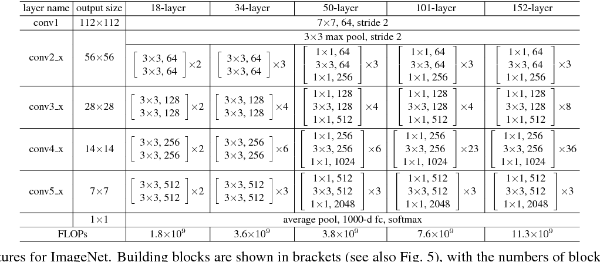

# Resnet

    

The `Resnet` architecture details are shown in this image. To shorten the implementation it's recommended to implement the residual block, the overall implementation generates layers based on a list of (`in_features`, `kernel_size`, `stride`, `padding`) 

## Residual Block
The `ResidualBlock` class generates the layer dynamically based on the parameters passed in the constructor (blocks and in_features). The `downsampling` is performed if the input and output channels are not the same or if the stride is greater than 1, this is done to match the number of channels of the 2 tensors or to match the width and height of the 2 tensors. In the `forward()` function the input is processed in 2 ways:
- trough every layer except the `downsample` path.
- only in the residual path

At the end the sum of the input passed trough every conv layer and the input passed trough the residual path are passed in `nn.ReLU()` and forward to the next `ResidualBlock`.

## Implementation
After implementing the `ResidualBlock` to create every version of the Resnet architecture as shown in the image, 3 functions were made to simplify the building process:
- `_build_residual_blocks()`: this function returns a list of 4 elements (out_features, kernel_size, stride, padding) for every layer specified in `building_blocks`
- `_create_in_feature_maps_list()`: this function returns a list of numbers, they represent the in_features for every layer specified in `building blocks` and `in_features`
- `_make_layer()`: this functions uses the result of the 2 previous functions to generate the layers of every residual block

The `Resnet` class need 2 parameters:
- `layers`: this value can be `18`, `34`, `50`, `101` and `152`
- `num_classes`: the number of classes