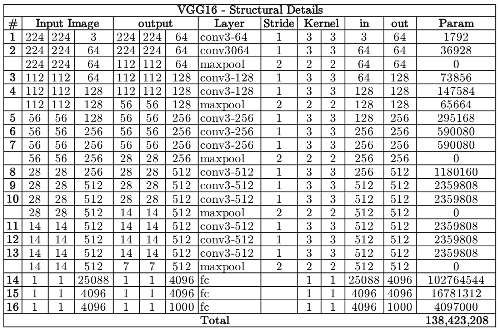

# VGG-16
<div style="text-align: center;">
    
</div>

## Implementation
In this architecture it's shown that there are more than one `conv` layers stacked one after another. Don't make the mistake to put a `conv` layer after another one, usually there is an `batch-norm` (optional) followed by an activation function after every `conv` layer. 
```python
self.layer = nn.Sequential(
    nn.Conv2d(),
    nn.BatchNorm2d(), # batch-norm
    nn.ReLU()         # activation function
    
    # next conv layer
    nn.Conv2d(),
    nn.BatchNorm2d(),
    nn.ReLU()  
)
``` 
The image is very explanatory for the parameters to set, except for the padding values. Those values are set to 1 to match the output size of every layer as shown in the image.
### Flattening stage
The first `fully-connected` layer has `25088` parameters; it's very simple to calculate it, the output of a `conv` layer is usually in this form: (4 elements)
$$ (\text{batch size}, \text{channels}, \text{height}, \text{width}) $$
To match the size of the `fc` just use `nn.view()` function to get the output tensor in this form: (2 elements)
$$ (\text{batch size}, \text{channels} * \text{height} * \text{width}) $$
